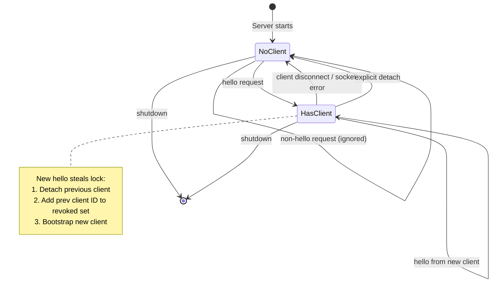

# openmux Architecture

> System architecture documentation for the openmux terminal multiplexer.

---

## Overview

openmux is a terminal multiplexer built with a modern stack combining **Bun** (runtime), **Zig** (native PTY/terminal emulation), **SolidJS** (reactive UI via OpenTUI), and **TypeScript** (application logic). It implements a Zellij-style master-stack tiling layout with detachable sessions.

### High-Level Data Flow

```
┌─────────────────┐     ┌──────────────┐     ┌──────────────────┐
│   Keyboard      │────▶│ KeyboardCtx  │────▶│ Layout Actions   │
│   Input         │     │              │     │ (reducer pattern)  │
└─────────────────┘     └──────────────┘     └──────────────────┘
                                                        │
                        ┌─────────────────┐              ▼
                        │  SessionBridge  │     ┌──────────────────┐
                        │  (persistence)  │◀────│   Workspace/     │
                        │                 │     │   Pane State     │
                        └─────────────────┘     └──────────────────┘
                                                        │
┌─────────────────┐     ┌──────────────┐                 ▼
│   PTY Data      │────▶│   zig-pty    │────▶┌──────────────────┐
│   (shell proc)  │     │   (Zig)      │     │  GhosttyVT       │
└─────────────────┘     └──────────────┘     │  (libghostty-vt) │
                                               └──────────────────┘
                                                        │
                                               ┌────────┴─────────┐
                                               ▼                  ▼
                                        ┌──────────────┐   ┌──────────────┐
                                        │  Shim Server │   │  TerminalCtx │
                                        │  (optional)  │   │              │
                                        └──────────────┘   └──────────────┘
                                               │                  │
                                               ▼                  ▼
                                        ┌──────────────┐   ┌──────────────┐
                                        │  Shim Client │   │ TerminalView │
                                        │  (UI proc)   │   │  (SolidJS)   │
                                        └──────────────┘   └──────────────┘
```

### Technology Stack

| Component           | Technology           | Purpose                                   |
| ------------------- | -------------------- | ----------------------------------------- |
| Runtime             | Bun                  | Package management, test runner, bundling |
| Native PTY          | zig-pty              | Shell process management (pure Zig)       |
| Terminal Emulation  | libghostty-vt        | VT parsing and terminal state (Ghostty)   |
| UI Framework        | SolidJS + OpenTUI    | Reactive terminal UI with reconciler      |
| Error Handling      | errore               | Type-safe, Go-style error returns         |
| Resource Management | AsyncDisposableStack | Guaranteed cleanup with `using` keyword   |

---

## Effect Services

The Effect layer provides a service-oriented architecture with explicit error handling and resource management. It replaces heavy monadic Effect.ts patterns with simpler, type-safe Go-style error returns.

### Error Handling Pattern (errore)

Functions return `Result | Error` unions. Callers explicitly check for errors using `instanceof`:

```typescript
import { tryAsync, tryFn as trySync } from 'errore';
import { createTaggedError } from 'errore';

// Define tagged error with template message
export class PtySpawnError extends createTaggedError({
  name: 'PtySpawnError',
  message: 'Failed to spawn PTY shell $shell in $cwd: $reason',
}) {}

// Async operation returns union
async function spawnPty(cwd: string, shell: string): Promise<PTYSession | PtySpawnError> {
  const result = await tryAsync<PTYSession, PtySpawnError>({
    try: () => nativeSpawn(cwd, shell),
    catch: (e) => new PtySpawnError({ shell, cwd, reason: String(e) }),
  });

  // Golang-style: if err != nil { return err }
  if (result instanceof PtySpawnError) {
    return result;
  }

  return result;
}
```

### Resource Management (using + ResourceStack)

TypeScript's Explicit Resource Management (`using` keyword) combined with `AsyncDisposableStack` provides guaranteed cleanup:

```typescript
import { ResourceStack } from './effect/resources';

async function processPty(ptyId: string): Promise<void | PtyError> {
  await using resources = new ResourceStack();

  // Defer cleanup (LIFO order)
  const tempFile = await createTempFile();
  resources.defer(() => fs.unlink(tempFile));

  // Register subscriptions, timers, abort controllers
  const unsub = subscribeToUpdates(ptyId, handleUpdate);
  resources.registerSubscription(unsub);

  const controller = new AbortController();
  resources.registerAbortController(controller);

  // Cleanup runs automatically on scope exit
  return await doWork(controller.signal);
}
```

### Service Composition

Services are composed in `effect/services.ts`:

| Service           | Purpose                                |
| ----------------- | -------------------------------------- |
| `FileSystem`      | Session/template persistence           |
| `PtyService`      | PTY lifecycle (spawn, resize, destroy) |
| `SessionStorage`  | Session persistence to disk            |
| `SessionManager`  | Session CRUD and switching             |
| `Clipboard`       | System clipboard access                |
| `TemplateStorage` | Session template persistence           |
| `KeyboardRouter`  | Keybinding dispatch                    |

---

## Shim Protocol

The shim protocol enables **detach/attach** functionality—sessions persist in a background process while the UI can disconnect and reconnect.

### Architecture

```
┌─────────────────────────────────────────────────────────────────┐
│                    SHIM SERVER PROCESS                          │
│  ┌─────────────┐  ┌──────────────┐  ┌──────────────────────┐  │
│  │   Server    │  │   Handlers   │  │   State              │  │
│  │   (net)     │──│   (RPC)      │──│   (Maps + Lock)      │  │
│  └─────────────┘  └──────────────┘  └──────────────────────┘  │
│         │                │                    │                │
│         ▼                ▼                    ▼                │
│  ┌─────────────┐  ┌──────────────┐  ┌──────────────────────┐  │
│  │ FrameReader │  │  PTY Service │  │ activeClient       │  │
│  │ (protocol)  │  │  (via bridge)│  │ activeClientId     │  │
│  └─────────────┘  └──────────────┘  │ bootstrappingPtyIds│  │
│                                      │ revokedClientIds   │  │
│                                      └──────────────────────┘  │
└─────────────────────────────────────────────────────────────────┘
                              │
                              │ Unix Socket (~/.config/openmux/sockets/)
                              ▼
┌─────────────────────────────────────────────────────────────────┐
│                    SHIM CLIENT (UI Process)                     │
│  ┌─────────────┐  ┌──────────────┐  ┌──────────────────────┐  │
│  │ Connection  │  │ sendRequest  │  │ RemoteEmulator       │  │
│  │ (retry)     │──│   (RPC)      │──│ (ITerminalEmulator)  │  │
│  └─────────────┘  └──────────────┘  └──────────────────────┘  │
│         │                │                    │                │
│         ▼                ▼                    ▼                │
│  ┌─────────────┐  ┌──────────────┐  ┌──────────────────────┐  │
│  │ FrameReader │  │   Caching    │  │ TerminalContext      │  │
│  │ (protocol)  │  │   (metadata) │  │ (shim mode)          │  │
│  └─────────────┘  └──────────────┘  └──────────────────────┘  │
└─────────────────────────────────────────────────────────────────┘
```

### Protocol Frame Format

```
[4 bytes: total frame length][4 bytes: header length][header JSON][payloads...]
```

Frame types: `request`, `response`, `event`

### Single-Client Lock Semantics

The shim server maintains a **single-client lock** to ensure only one UI process controls the session at a time:

| State Variable        | Purpose                                                            |
| --------------------- | ------------------------------------------------------------------ |
| `activeClient`        | Socket of the currently attached client                            |
| `activeClientId`      | Unique ID of the active client                                     |
| `revokedClientIds`    | Set of recently detached client IDs (prevents immediate reconnect) |
| `bootstrappingPtyIds` | PTYs currently in bootstrap replay (suppresses duplicate events)   |

#### State Machine



#### Lock Acquisition Flow

```
New Client          Shim Server              Previous Client
    │                     │                         │
    │─── hello ─────────▶│                         │
    │   (with clientId)   │                         │
    │                     │─── cleanupCurrent() ───▶│
    │                     │   sendDetached()        │
    │                     │   socket.end()          │
    │                     │   (250ms delay destroy) │
    │                     │                         │
    │                     │── rememberRevoked() ───▶│
    │                     │   (adds prev ID to set) │
    │                     │                         │
    │◀── bootstrap ───────│                         │
    │   (subscribeAll)    │                         │
    │                     │                         │
```

#### Bootstrap Replay Protection

During client attachment, the server replays current PTY state to the new client. To prevent race conditions:

1. PTY IDs are added to `bootstrappingPtyIds` during replay
2. Live `ptyUpdate`/`ptyKitty` events are suppressed for bootstrapping PTYs
3. Once replay completes, the PTY ID is removed and live events resume

```typescript
// In event handler
if (state.bootstrappingPtyIds.has(ptyId)) {
  if (header.type === 'ptyUpdate' || header.type === 'ptyKitty') {
    return; // Suppress - will be sent by replay
  }
}
```

---

## Terminal

The terminal layer abstracts PTY communication and terminal emulation through the `ITerminalEmulator` interface.

### Layer Architecture

```
┌─────────────────────────────────────────────┐
│              TerminalContext                │
│         (PTY lifecycle management)          │
└─────────────────────────────────────────────┘
                      │
        ┌─────────────┼─────────────┐
        ▼             ▼             ▼
┌──────────────┐ ┌──────────┐ ┌──────────────┐
│   Local Mode │ │Shim Mode │ │  Test Mode   │
│              │ │          │ │              │
│ GhosttyVT    │ │ShimClient│ │ Mock         │
│ (libghostty) │ │(Remote)  │ │ Emulator     │
└──────────────┘ └──────────┘ └──────────────┘
        │             │             │
        └─────────────┴─────────────┘
                      │
                      ▼
           ┌────────────────────┐
           │ ITerminalEmulator  │
           │  Interface         │
           ├────────────────────┤
           │ write(data)        │
           │ resize(cols,rows)  │
           │ getDirtyUpdate()   │
           │ getTerminalState() │
           │ search(query)      │
           │ onUpdate(callback) │
           └────────────────────┘
```

### Emulator Interface

The `ITerminalEmulator` interface (`src/terminal/emulator-interface.ts`) provides:

| Method                        | Purpose                                   |
| ----------------------------- | ----------------------------------------- |
| `write(data)`                 | Parse VT sequences, update terminal state |
| `resize(cols, rows)`          | Resize terminal dimensions                |
| `getDirtyUpdate(scrollState)` | Get incremental changes (optimization)    |
| `getTerminalState()`          | Get complete state (resize, alt screen)   |
| `search(query, opts)`         | Search scrollback + visible area          |
| `onUpdate(callback)`          | Subscribe to state changes                |

### Dirty Terminal Updates

A key optimization: instead of returning full terminal state on every update, the emulator returns only changed rows:

```typescript
interface DirtyTerminalUpdate {
  dirtyRows: Map<number, TerminalCell[]>; // Only changed rows
  cursor: TerminalCursor; // Always included
  scrollState: TerminalScrollState; // Always included
  isFull: boolean; // True after resize/alt-switch
  fullState?: TerminalState; // Complete state when isFull
  // ...modes
}
```

This enables efficient React rendering—only dirty rows trigger re-renders.

### Ghostty VT Integration

- Native Zig library: `libghostty-vt` via wrapper in `native/zig-ghostty-wrapper/`
- Tracks submodule in `vendor/ghostty`
- Provides VT parsing, terminal state, scrollback buffer
- Updated via `scripts/update-ghostty-vt.sh`

---

## Core Layout

openmux uses a **master-stack tiling layout** inspired by Zellij. Each workspace contains a main pane and a stack of secondary panes.

### Layout Modes

```
┌─────────────────────────────────────────────────────────────────┐
│                        VERTICAL MODE                            │
│  ┌───────────────────────┐  ┌───────────────────────────────┐  │
│  │                       │  │         Stack Pane 1          │  │
│  │                       │  ├───────────────────────────────┤  │
│  │      Main Pane        │  │         Stack Pane 2          │  │
│  │      (50% width)      │  ├───────────────────────────────┤  │
│  │                       │  │         Stack Pane 3          │  │
│  │                       │  │                               │  │
│  └───────────────────────┘  └───────────────────────────────┘  │
└─────────────────────────────────────────────────────────────────┘

┌─────────────────────────────────────────────────────────────────┐
│                       HORIZONTAL MODE                           │
│  ┌───────────────────────────────────────────────────────────┐│
│  │                      Main Pane (50% height)                 ││
│  └───────────────────────────────────────────────────────────┘│
│  ┌───────────────────┐┌───────────────────┐┌───────────────┐│
│  │   Stack Pane 1    ││   Stack Pane 2    ││ Stack Pane 3  ││
│  └───────────────────┘└───────────────────┘└───────────────┘│
└─────────────────────────────────────────────────────────────────┘

┌─────────────────────────────────────────────────────────────────┐
│                        STACKED MODE                             │
│  ┌───────────────────────┐  ┌───────────────────────────────┐  │
│  │                       │  │ ┌─────┐┌─────┐┌─────┐            │  │
│  │      Main Pane        │  │ │ Tab ││ Tab ││ Tab │ (tabs)     │  │
│  │      (50% width)      │  │ └─────┘└─────┘└─────┘            │  │
│  │                       │  │                               │  │
│  │                       │  │     Active Stack Pane         │  │
│  │                       │  │     (only visible)            │  │
│  └───────────────────────┘  └───────────────────────────────┘  │
└─────────────────────────────────────────────────────────────────┘
```

### Workspace Structure

```typescript
interface Workspace {
  id: WorkspaceId; // 1-9
  label?: string; // User-defined name
  mainPane: LayoutNode | null; // Primary pane
  stackPanes: LayoutNode[]; // Secondary panes
  focusedPaneId: string | null;
  activeStackIndex: number; // For stacked mode
  layoutMode: 'vertical' | 'horizontal' | 'stacked';
  zoomed: boolean; // Fullscreen focused pane
}
```

### Layout Tree

Panes are organized in a tree structure allowing complex splits:

```
LayoutNode = SplitNode | PaneNode

SplitNode:
  - direction: 'horizontal' | 'vertical'
  - ratio: 0.0 - 1.0 (split position)
  - first: LayoutNode
  - second: LayoutNode

PaneNode:
  - id: unique identifier
  - ptyId: reference to PTY session
  - title: display name
  - cwd: working directory
  - rectangle: computed position/size
```

### Layout Calculation

The `calculateMasterStackLayout()` function in `src/core/operations/master-stack-layout.ts`:

1. Applies padding to viewport
2. Splits viewport into main/stack areas based on mode
3. Recursively calculates rectangles for all nodes
4. Uses **structural sharing**—returns original objects when unchanged

```typescript
// Structural sharing optimization
function updatePaneRectangle(pane: PaneData, newRect: Rectangle): PaneData {
  if (rectanglesEqual(pane.rectangle, newRect)) {
    return pane; // Same reference = no re-render
  }
  return { ...pane, rectangle: newRect };
}
```

---

## Contexts

SolidJS contexts provide reactive state management through a hierarchical provider tree.

### Provider Hierarchy

```
ConfigProvider                 # Configuration loading/reloading
  └── ThemeProvider            # Styling/theming
        └── LayoutProvider     # Workspace/pane state (reducer)
              └── KeyboardProvider    # Prefix mode, key state
                    └── TitleProvider     # Terminal title updates
                          └── TerminalProvider   # PTY lifecycle
                                └── SelectionProvider  # Text selection
                                      └── CopyModeProvider   # Copy mode state
                                            └── SearchProvider    # Terminal search
                                                  └── SessionBridge   # Session wiring
                                                        └── AggregateViewProvider
                                                              └── OverlayProvider
                                                                    └── AppContent
```

### Context Reference

| Context                 | Responsibility                     | Key Exports          |
| ----------------------- | ---------------------------------- | -------------------- |
| `ConfigProvider`        | Load/reload TOML config            | `useConfig()`        |
| `ThemeProvider`         | Color schemes, styling             | `useTheme()`         |
| `LayoutProvider`        | Workspace state, panes, navigation | `useLayout()`        |
| `KeyboardProvider`      | Keybindings, prefix mode, modes    | `useKeyboard()`      |
| `TitleProvider`         | Terminal title tracking            | `useTitle()`         |
| `TerminalProvider`      | PTY lifecycle, terminal state      | `useTerminal()`      |
| `SelectionProvider`     | Text selection, clipboard          | `useSelection()`     |
| `CopyModeProvider`      | Copy mode navigation               | `useCopyMode()`      |
| `SearchProvider`        | Terminal search state              | `useSearch()`        |
| `AggregateViewProvider` | Cross-workspace overview           | `useAggregateView()` |
| `OverlayProvider`       | Modals, notifications              | `useOverlays()`      |

### Reactivity Patterns

**Safe to destructure (plain functions):**

```tsx
const { newPane, closePane, focusPane } = useLayout();
const { createPTY, writeToPTY } = useTerminal();
```

**Safe via store proxy (reactive access):**

```tsx
const { state } = useLayout();
state.workspaces; // Reactive
state.activeWorkspaceId; // Reactive
```

**NOT safe to destructure (computed getters lose reactivity):**

```tsx
// DON'T: Destructuring calls getter once, loses reactivity
const { activeWorkspace, panes, isInitialized } = useLayout();

// DO: Access via context object
const layout = useLayout();
layout.activeWorkspace; // Calls getter each time, stays reactive
```

Computed getters by context (access via context object):

- `LayoutContext`: `activeWorkspace`, `panes`, `paneCount`, `populatedWorkspaces`, `layoutVersion`
- `TerminalContext`: `isInitialized`
- `SessionContext`: `filteredSessions`
- `SelectionContext`: `selectionVersion`, `copyNotification`
- `SearchContext`: `searchState`, `searchVersion`

### Layout Reducer Pattern

`LayoutProvider` uses a reducer pattern for state transitions:

```typescript
type LayoutAction =
  | { type: 'NEW_PANE'; title?: string }
  | { type: 'CLOSE_PANE' }
  | { type: 'FOCUS_PANE'; paneId: string }
  | { type: 'SWITCH_WORKSPACE'; workspaceId: WorkspaceId }
  | { type: 'SET_LAYOUT_MODE'; mode: LayoutMode };
// ...

function layoutReducer(state: LayoutState, action: LayoutAction): LayoutState {
  switch (action.type) {
    case 'NEW_PANE':
      return produce(state, (draft) => {
        // Mutations on draft
      });
    // ...
  }
}
```

Actions are batched for performance:

- Fast path for `SET_PANE_PTY`: direct store path update (no reconcile)
- Batchable actions (`CLOSE_PANE`, etc.): queued and flushed together

---

## Entry Points

| File               | Purpose                                           |
| ------------------ | ------------------------------------------------- |
| `src/index.tsx`    | CLI entry, renderer setup, service initialization |
| `src/shim/main.ts` | Shim server entry (background detach/attach)      |
| `src/App.tsx`      | Provider tree and top-level app wiring            |

---

## File Organization

```
src/
├── index.tsx              # CLI entry point
├── App.tsx                # Main app component
├── cli/                   # CLI argument parsing
├── shim/                  # Detach/attach protocol
│   ├── main.ts            # Shim server entry
│   ├── server.ts          # Socket server
│   ├── server-state.ts    # State + lock semantics
│   ├── client.ts          # Client RPC
│   └── handlers/          # Request handlers
├── effect/                # Services + error handling
│   ├── errors.ts          # Tagged error definitions
│   ├── resources.ts       # ResourceStack
│   ├── services/          # Service implementations
│   └── bridge/            # SolidJS/Effect bridge
├── terminal/              # Terminal emulation
│   ├── emulator-interface.ts  # ITerminalEmulator
│   ├── ghostty-vt/        # Native VT bindings
│   └── kitty-graphics/    # Image protocol
├── core/                  # Layout system
│   ├── types.ts           # Core type definitions
│   ├── operations/        # Layout reducer + actions
│   └── layout-tree.ts     # Tree utilities
├── contexts/              # SolidJS contexts
│   ├── LayoutContext.tsx
│   ├── TerminalContext.tsx
│   └── aggregate/         # Aggregate view state
└── components/            # UI components
    ├── PaneContainer.tsx
    ├── TerminalView.tsx
    └── app/               # App-level components
```

---

## Key Invariants

1. **Single Shim Client**: Only one UI process may hold the shim lock at a time. New clients steal the lock.

2. **Structural Sharing**: Layout calculations preserve object references when unchanged to minimize React re-renders.

3. **Dirty Updates**: Terminal emulators return only changed rows, not full state.

4. **Error as Values**: All errors are returned explicitly; no exceptions for expected failures.

5. **Resource Cleanup**: `using` keyword with `AsyncDisposableStack` guarantees cleanup on all exit paths.

6. **Reactive Access**: Computed getters must be accessed via context object, not destructured.

---

## See Also

- `AGENTS.md` - Build commands and code style guidelines
- `errore` skill (`.pi/skills/errore/`) - Error handling patterns
