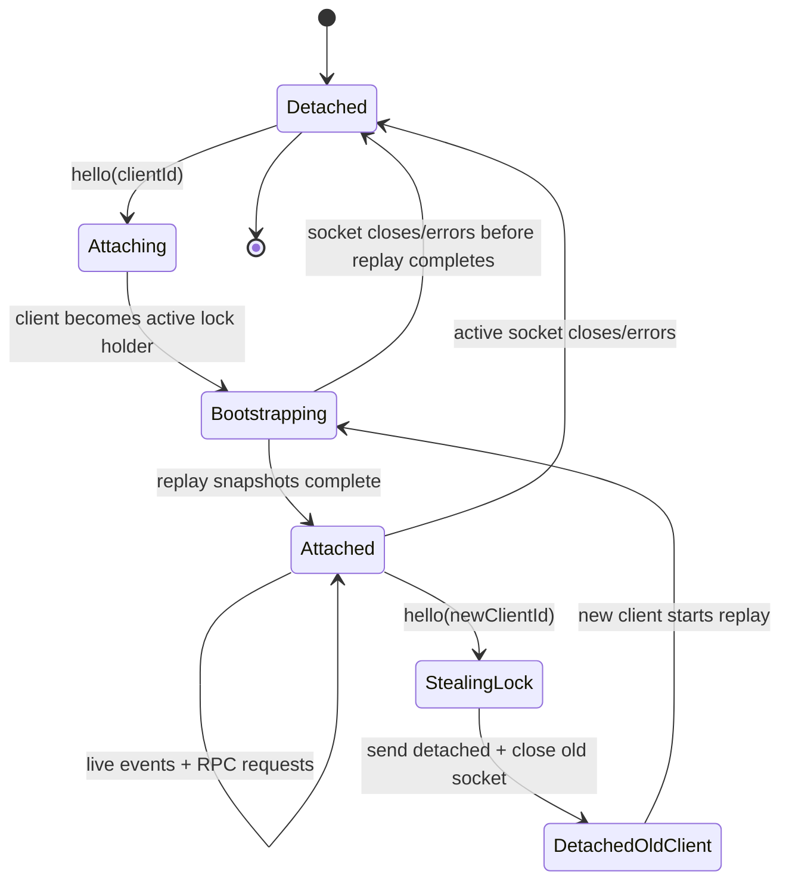

# Shim protocol

The shim is the authoritative owner of PTYs, emulator state, and attach/detach lifecycle.
The UI process is a cache + renderer. During attach, the client receives a replay snapshot,
then switches to the live event stream.

## Design rules

- **Server is source of truth.** PTY state lives in the shim.
- **Single-client lock.** Exactly one attached UI receives live events and can issue normal RPCs.
- **Connection-based lifecycle.** Attach validity is guarded by the active socket/client pair, not an epoch counter.
- **Backwards-compatible transition.** New consolidated RPCs can coexist with legacy getters until callers migrate.

## Attach / detach state machine



### State transitions

1. **Detached**
   - No active client socket.
   - PTYs and emulator state keep running in the shim.
   - Kitty transmit forwarding stays enabled so replay data remains cacheable.

2. **Attaching**
   - A client sends `hello { clientId }`.
   - If the `clientId` is currently revoked, the shim rejects the connection.

3. **Bootstrapping**
   - The new socket becomes the active lock holder.
   - The shim subscribes to active PTYs, replays full snapshots, then wires global lifecycle/title/activity subscriptions.
   - Every async stage re-checks the active socket/client pair before sending replay frames.

4. **Attached**
   - The client receives live PTY updates.
   - Normal RPC requests are accepted only from the active socket.

5. **StealingLock / DetachedOldClient**
   - A new successful `hello` steals the lock.
   - The previous client gets a `detached` event and its socket is closed.
   - The old `clientId` is revoked temporarily so it cannot immediately reconnect and fight for the lock.

## Single-client lock semantics

The shim intentionally behaves like a **single active consumer**:

- Only `hello` is accepted from inactive sockets.
- Any other request from a stale socket gets `Inactive client`, then the socket is closed.
- The most recent successful `hello` wins.
- Replay and live events always target `state.activeClient`.

This preserves detach/attach UX while avoiding split-brain rendering or duplicate input streams.

## Revoked client ID policy

Detached client IDs are kept in a bounded FIFO set:

- Purpose: block a detached UI from immediately reconnecting after losing the lock.
- Storage: `state.revokedClientIds`
- Purge rule: keep only the most recent `MAX_REVOKED_CLIENT_IDS` entries.

This prevents unbounded memory growth while still protecting the active client handoff window.

## RPC shape

### Consolidated metadata RPC

`getPtyMetadata(ptyId)` is the preferred read API for slow-changing PTY metadata:

```ts
{
  session: {
    id: string,
    pid: number,
    cols: number,
    rows: number,
    cwd: string,
    shell: string,
  } | null,
  cwd: string | null,
  foregroundProcess?: string,
  gitInfo?: GitInfo,
  gitDiffStats?: GitDiffStats,
  title: string,
  lastCommand?: string,
}
```

Legacy getters like `getCwd`, `getSession`, `getForegroundProcess`, `getGitInfo`,
`getGitDiffStats`, `getTitle`, and `getLastCommand` should be treated as compatibility
wrappers over the consolidated metadata payload.

### Terminal state RPCs

- `getTerminalState(ptyId)` → packed full terminal snapshot
- `getScrollState(ptyId)` → viewport + scrollback metadata
- `getScrollbackLines(ptyId, startOffset, count)` → packed scrollback rows
- `capturePane(ptyId, options)` → text/ANSI capture for commands and automation

### Mutating RPCs

- `createPty`
- `write`
- `sendFocusEvent`
- `resize`
- `destroy`
- `destroyAll`
- `setScrollOffset`
- `setUpdateEnabled`
- `registerPane`

## Unified event stream

The wire stream is logically one subscription. Different frame types are just variants of the same stream:

- `ptyUpdate`
- `ptyExit`
- `ptyLifecycle`
- `ptyTitle`
- `ptyActivity`
- `ptyKitty`
- `ptyKittyTransmit`
- `ptyNotification`
- `detached`

Client code should subscribe once and fan out locally, instead of maintaining unrelated subscriber registries for each event type.

## Client cache model

The client keeps a lightweight per-PTY cache for:

- latest terminal snapshot
- scroll state
- kitty graphics state
- metadata snapshot / in-flight metadata request
- lazily created remote emulator proxy

That cache is **derived state**. If it is missing or stale, the client rehydrates from the shim.
